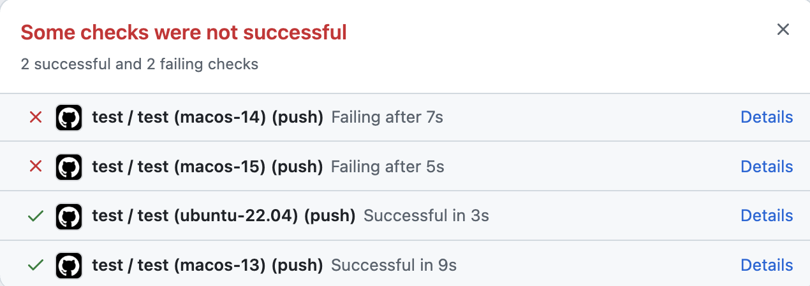

# `iconv()` bug on macOS 14 (Sonoma) and 15 (Sequoia)

[macos\_iconv\_bug.c](macos_iconv_bug.c) is a program that convert a string "こんにちはABC世界XY" (`U+3053` `U+3093` `U+306B` `U+3061` `U+306F` 'A' 'B' 'C' `U+4E16` `U+754C` 'X' 'Y') from `UTF-32LE` to `SHIFT_JIS` (a legacy Japanese encoding).

Expected output bytes are: `0x82 0xb1` (こ) `0x82 0xf1` (ん) `0x82 0xc9` (に) `0x82 0xbf` (ち) `0x82 0xcd` (は) `0x41` (A) `0x42` (B) `0x43` (C)  `0x90 0xa2` (世) `0x8a 0x45` (界) `0x58` (X) `0x59` (Y).

It outputs the expected bytes on Linux (Ubuntu Linux 22.04) and macOS 13 (Ventura).

But on macOS 14 (Sonoma) and 15 (Sequoia) it outputs `0x82 0xb1` (こ) `0x82 0xf1` (ん) `0x82 0xc9` (に) `0x82 0xbf` (ち) `0x82 0xcd` (は) `0x41` (A) `0x90 0xa2` (世) `0x8a 0x45` (界) `0x58` (X) `0x59` (Y). Note that `0x42` (B) and `0x43` (C) are missing from the output.

I noticed this problem by the CI failure of my `bytestring-encoding` package for Haskell ([issue](https://github.com/msakai/bytestring-encoding/issues/15)).

## How to test

On macOS:

```console
$ gcc macos_iconv_bug.c -liconv -o macos_iconv_bug
$ ./macos_iconv_bug
```

On Linux:

```console
$ gcc macos_iconv_bug.c -o macos_iconv_bug
$ ./macos_iconv_bug
```

After the execution, `PASS` or `FAIL` is printed, and the output bytes are saved in the `result.txt` file.

## Result on GitHub Actions 

I prepared [a GitHub Actions workflow](.github/workflows/test.yaml) to run the test program. The result is as follows:



## Versions of `libiconv`

According to the [Apple Open Source](https://opensource.apple.com/releases/) page, macOS 13.5 uses [libiconv-64](https://github.com/apple-oss-distributions/libiconv/tree/libiconv-64) and macOS 14.0 uses [libiconv-80.1.1](https://github.com/apple-oss-distributions/libiconv/tree/libiconv-80.1.1) ([diff](https://github.com/apple-oss-distributions/libiconv/compare/libiconv-64...libiconv-80.1.1)).


